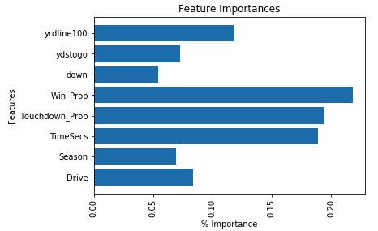

# NFL Pass run Prediction

Is it possible to predict whether an NFL team will run or pass the football on any given play? Given two hours
and NFL data dating back to 2009 I attempted to answer that question.

## The Data

The data we used was sourced from Kaggle and it includes over one-hundred features and over three-hundred thousand rows
of data.

Although there were over a hundred features provided, we were only able to use a handful. Several of the features provided
were data points documented after the play. We can't use data documented after the play to determine what the play would
be. This would be an example of data leakage.

## Feature Selection

I would call myself a casual NFL fan meaning I have a fairly good understanding of the rules of the game. The first approach
was to use features I felt would be important in determining whether a play would result in a pass or run. The features chosen
are as follows:
- Down
- Drive
- Time (in seconds)
- Yards to go
- Yard Line (from 0-100)
- Win Probability
- Season
- Touchdown Probability

We used these inputs to determine the Play Type (run or pass).

## The Model

Because we're trying to predict what category a play falls into (run or pass) and we want to determine which features
are most important in predicting those categories, I used a Random Forest Classifier.

Below is a chart depicting which features are most important in predicting whether a play will result in a run or pass.

### Model Performance

Given the inputs above, I was able to create a Random Forest Classifier that correctly predicts run or pass 67% of the time.
The model performance isn't amazing but it does result in a 10% increase from random guessing. This model probably
shouldn't be used on it's own, but if used in conjunction with other play-calling techniques it could prove to be a powerful
tool.

## Future Work

This project started with a strict two-hour deadline. I wanted to see if I could create a strong model with minimal inputs
and feature engineering. More work can be done to analyze the specific quarter-back tendencies or coaching techniques to use
as inputs to increase the accuracy of this model.

Thanks for reading and I hope you found this project interesting.

